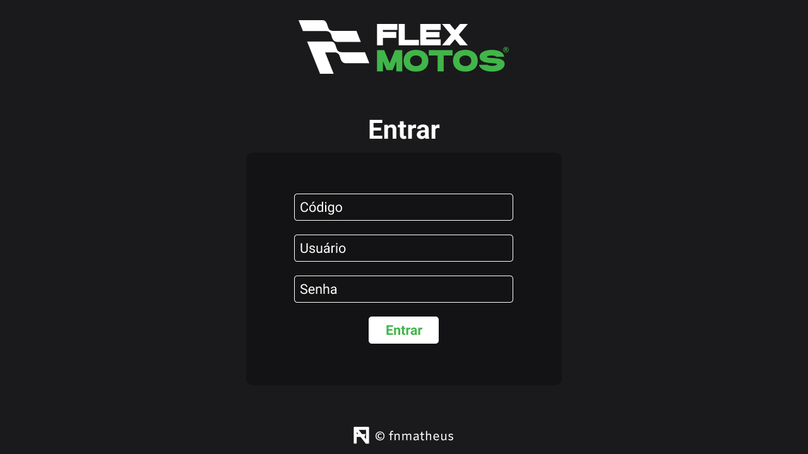
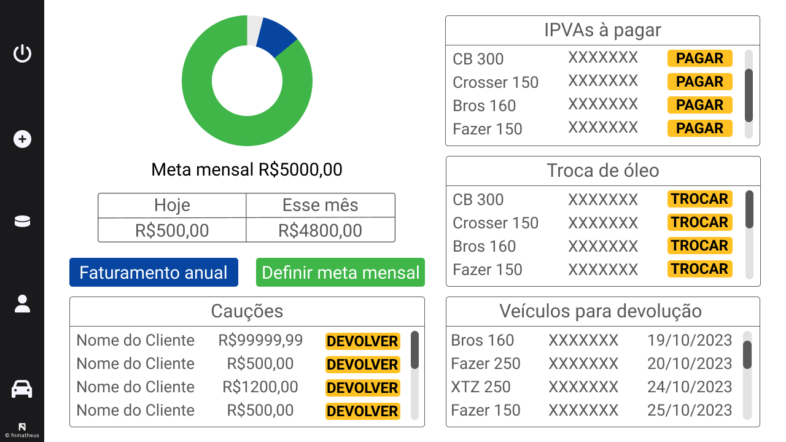

  

<h1 align="center">🏍️ Flex Motos</h1>
<h2 align="center">Sistema de gestão</h2>

<h4 align="center"> 
	🚧  Flex Motos 🚀 Em construção...  🚧
</h4>

Tabela de conteúdos
=================
<!--ts-->
   * [Sobre o projeto](#-sobre-o-projeto)
   * [Funcionalidades](#-funcionalidades)
   * [Layout](#-layout)
     * [Web](#web)
   * [Tecnologias](#-tecnologias)
   * [Autor](#-autor)
   * [Licença](#user-content--licença)
<!--te-->

## 💻 Sobre o projeto

🏍️ Flex Motos - um sistema para facilitar a gestão e contabilidade da Flex Motos (locação de motos).

---

## ⚙️ Funcionalidades

- [x] Tela de Login e usuários:
  - [x] Logar e deslogar de contas
  - [x] Diferenciar usuários através de classificações. Ex: administrador e usuário
  - [x] Deletar seu usuário e se for administrador deletar outros usuários
  - [x] Editar seu usuário e se for administrador editar outros usuários
  - [x] Filtrar os usuários

- [x] Dashboard:
  - [x] Gerenciar o faturamento
  - [x] Controle da troca de óleo
  - [x] Controle do IPVA
  - [x] Controle dos cauções
  - [x] Controle dos veículos para devolução
     
- [x] Clientes:
  - [x] Cadastrar novos clientes
  - [x] Editar os dados dos clientes
  - [x] Histórico de veículos alugados
  - [x] Status em relação aos alugueis
  - [x] Filtrar os úsuarios

- [x] Veículos:
  - [x] Cadastrar novos veículos
  - [x] Editar os dados dos veículos
  - [x] Valor arrecadado mensamente com o veículo
  - [x] Status se está alugado ou não
  - [x] Filtrar os veículos

---

## 🎨 Layout

O layout da aplicação está disponível no Figma:

**[Acessar Figma](https://www.figma.com/file/b6cdlNdNmVymvntQb99EK4/JR?type=design&node-id=0%3A1&mode=design&t=IJNaztKxyBpVRR7P-1)**

### Web

  
  

---

## 🛠 Tecnologias

As seguintes ferramentas foram usadas na construção do projeto:

#### **Website**  ([Next.js](https://nextjs.org/)  +  [TypeScript](https://www.typescriptlang.org/))

#### **Banco de Dados**  ([Nodejs](https://nodejs.org/en/)  +  [Mongodb](https://www.mongodb.com/pt-br) + [Mongoose](https://mongoosejs.com/)) além de outras dependencias

#### **Utilitários**

-   Protótipo:  **[Figma](https://www.figma.com/)**  →  **[Protótipo (Portifolio)](https://www.figma.com/file/b6cdlNdNmVymvntQb99EK4/JR?type=design&node-id=0%3A1&mode=design&t=IJNaztKxyBpVRR7P-1)**
-   Editor:  **[Visual Studio Code](https://code.visualstudio.com/)**
-   Ícones:  **[Font Awesome](https://fontawesome.com/)**
-   Fontes:  **[Roboto](https://fonts.google.com/specimen/Roboto)**

---

## 🙋‍♂️ Autor

<a href="https://github.com/fnmatheus">
 
  
 
Matheus Nascimento

  
</a>

 

---

## 📝 Licença

Este projeto esta sobe a licença [MIT](./LICENSE).

Feito por Matheus Nascimento 👋🏽 [Entre em contato!](https://www.linkedin.com/in/fnmatheus/)

---